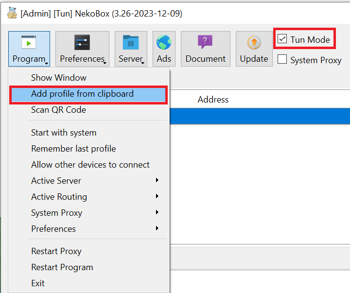
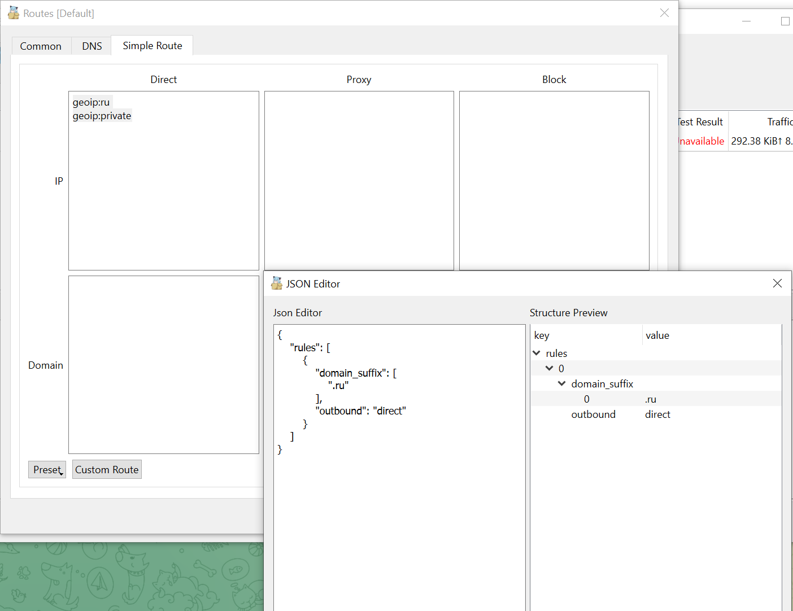
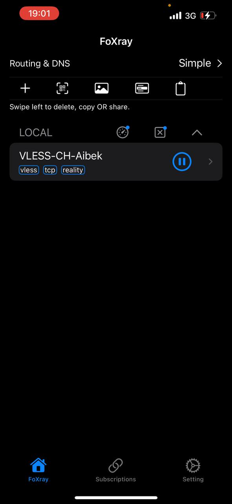
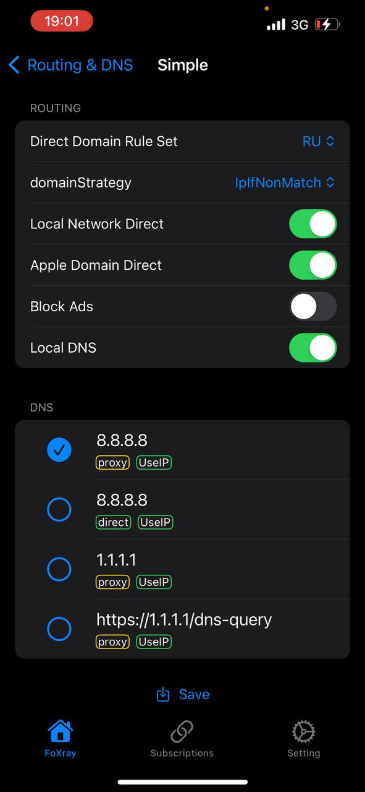

# XRay + VLESS + XTLS-Reality

VLESS is a stateless lightweight transport protocol that consists of inbound and outbound parts. It can serve as a bridge between Xray clients and servers. Unlike VMess, VLESS does not rely on system time. The authentication method is still UUID-based.

## Установка

Чтобы настроить клиент вам потребуется QR-код + qr-ссылка, которые я вам передам. Если у вас их нет - **напишите мне**.

### Windows / Linux

Потребуется GUI-приложение Nekobox / Nekoray, последние версии можно скачать с [github](https://github.com/Matsuridayo/nekoray/releases). В названиях архивов написано для какой операционной системы предназначено.

**ВАЖНО: ПРИЛОЖЕНИЕ ЗАПУСКАТЬ ОТ ИМЕНИ АДМИНИСТРАТОРА**

При первом запуске выберите ядро (core) под названием `sing-box`


Для добавления профиля скопируйте qr-ссылку в буфер обмена и с помощью соотвествующего меню добавьте конфиг



После этого переходите по вкладкам Preferences > Routing Settings, выбирайте подменю "Simple Route" и устанавливайте данные как на скриншоте:



Direct IP:

```
geoip:ru
geoip:private
```

Custom Route:

```
{
    "rules": [
        {
            "domain_suffix": [
                ".ru"
            ],
            "outbound": "direct"
        }
    ]
}
```

Для запуска VPN нажмите правой кнопкой по профилю, после этого кнопку "Старт" / "Start"ю

### Android

Для Android тоже есть NekoBox, доступный в [Google Play](https://play.google.com/store/apps/details?id=moe.nb4a) либо с [github](https://github.com/MatsuriDayo/NekoBoxForAndroid/releases).

### iOS

Из доступных вариантов есть [FoXray](https://apps.apple.com/us/app/foxray/id6448898396).

Открываете приложение, у вас вылезает следующее меню (только у вас не будет добавленного vpn): 



Для начала надо импортировать настройки, которые я вам передал. Это можно сделать считав QR-код, либо же вставив qr-ссылку.

После этого нажмите на "Routing & DNS", перейдите в меню "Simple" и установите настройки так, как показано на скриншоте ниже:



Сохраните настройки кнопкой "Save" внизу. Выберите "Simple" и снова сохранитесь. Готово!

--

* https://whatismyipaddress.com/ - Здесь должно показывать Швейцарию
* https://2ip.ru/ - здесь ваш реальный IP РФ
