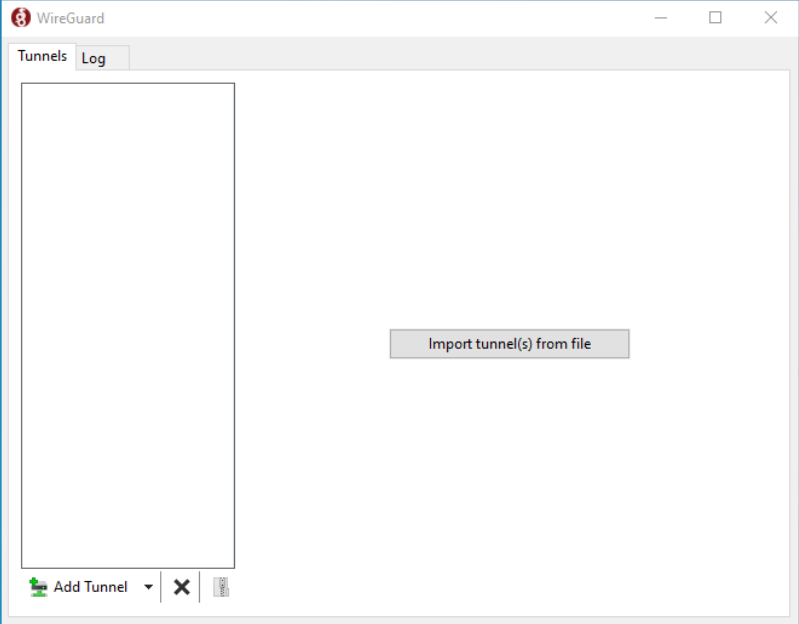
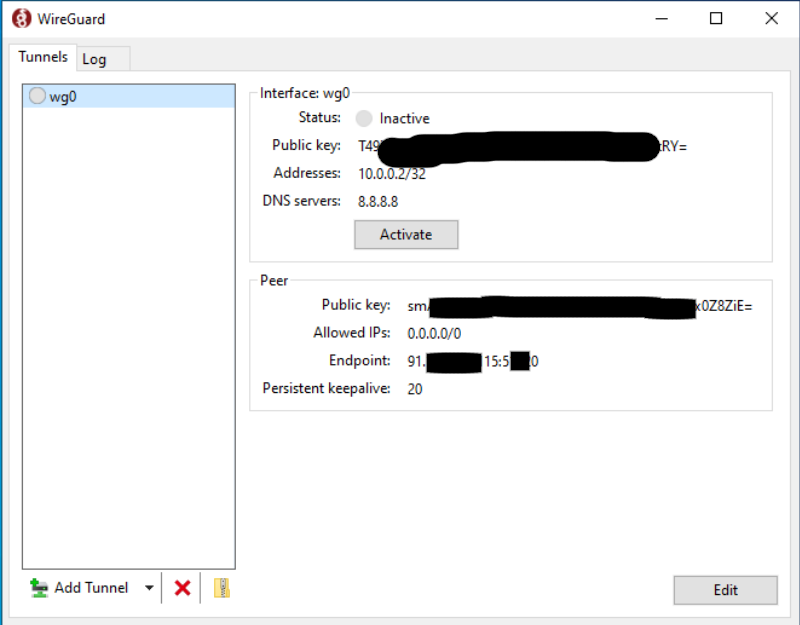

# WireGuard

VPN с открытым исходным кодом.

## Установка

Прежде всего вам надо скачать и установить клиент на свое устройство. Сделать это можно на [официальном сайте](https://www.wireguard.com/install/), там имеются все инструкции. Клиенты есть для всех популярных платформ - Linux, Windows, Android, iOS.

Чтобы перейти к настройке клиента, я вам должен передать вам конфигурационный файл. Если у вас его нет - **напишите мне**.

### Windows

Открываете приложение, у вас вылезает следующее окошко:



Вам надо нажать "Import tunnel(s) from file" и выбрать файл c конфигурацией. После этого окошко измениться и будет содержать отображать ваши данные, который были в файле. Выглядит это следующим образом



Чтобы включить VPN - нажимайте кнопку "Activate". Чтобы выключить - "Deactivate".

### Linux

Файл с конфигурацией переместите в директорию `etc/wireguard` (TODO: какие права доступа должны быть?).

Включение VPN (требует прав root, но включать надо от обычного пользователя):

```
$ wg-quick up wg0
```

Выключение VPN:

```
$ wg-quick down wg0
```

### Android & iOS

Откройте приложение, нажмите на кнопку "+" (справа внизу) и в предложенно списке нажмите "import from file or archive". После этого выбирайте файл с конфигурацией. ВСЕ :)

Чтобы включить/включить VPN достаточно передвинуть кнопку-переключатель. 
